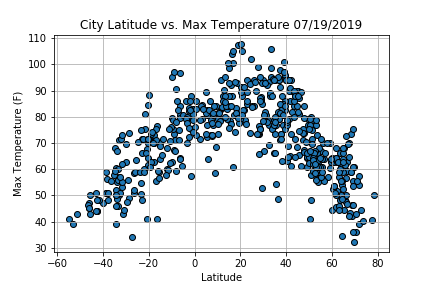
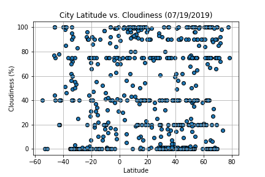

# How is the weather?
# Background:
Create  a Python script to visualize the weather of 500+ cities across the world of varying distance from the equator. To accomplish this,  utilize a Python library, the OpenWeatherMap API, and a little common sense to create a representative model of weather across world cities.

#### Build a series of scatter plots to showcase the following relationships:
  * Temperature (F) vs. Latitude
    * 
  * Humidity (%) vs. Latitude
  * Cloudiness (%) vs. Latitude
    * 
  * Wind Speed (mph) vs. Latitude

#### The final notebook does the following:

  * Randomly selects at least 500 unique (non-repeat) cities based on latitude and longitude.
  * Performs a weather check on each of the cities using a series of successive API calls.
  * Includes a print log of each city as it's being processed with the city number and city name.
  * Saves both a CSV of all data retrieved and png images for each scatter plot.

#### Whats the weather like?
  *The main file's name is ValmontHW6_WeaterPy.ipynb
  *The generated .csv file is named randomcityweather
  * There are 4 png files that were created from the main file
  * The only word document describes what observations were made
  * The api key file of the project owner was taken out for security reasons
